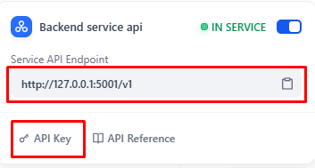
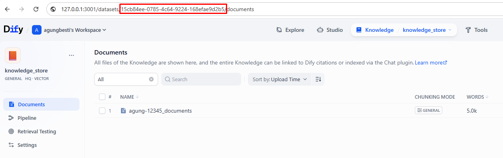
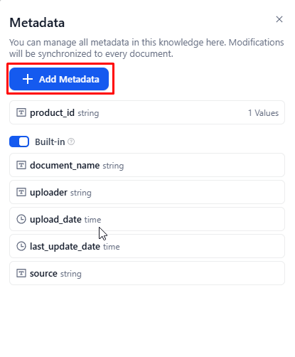
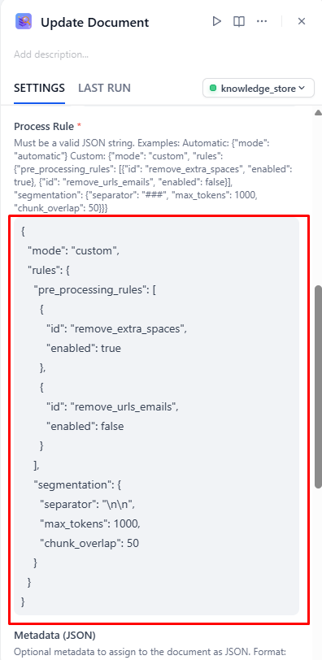
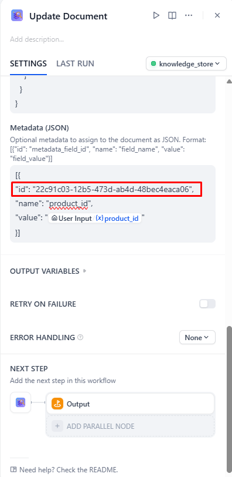
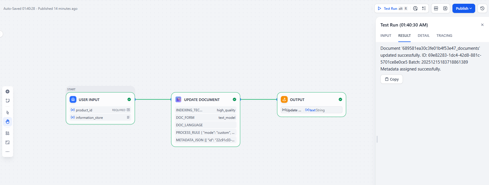
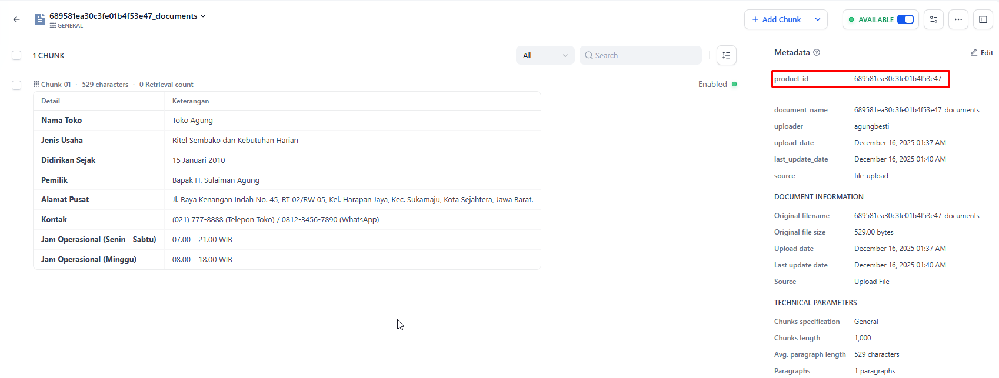

# Knowledge Pro

<p align="center">
  
</p>

**Author:** [abesticode](https://github.com/abesticode)  
**Version:** 0.0.5  
**Type:** tool
**Repo:** https://github.com/abesticode/dify-plugin-knowledge-pro


## Description

Knowledge Pro is a comprehensive AI Agent tool designed for managing Dify Knowledge Bases (Datasets) via the Dify API. It provides a complete set of operations for knowledge base maintenance, document management, content chunk manipulation, and metadata filtering.

## Features

### 📁 Dataset Operations
| Tool | Description |
|------|-------------|
| **Create Dataset** | Create new empty knowledge bases |
| **List Datasets** | Browse available knowledge bases with pagination |
| **Delete Dataset** | Remove knowledge bases permanently |

### 📄 Document Operations
| Tool | Description |
|------|-------------|
| **Create/Update Document** | Add new documents with text content, or update existing ones by name. Supports advanced options like chunk method, process rules, and metadata assignment |
| **List Documents** | Browse documents in a knowledge base |
| **Delete Document** | Remove documents permanently |
| **Get Indexing Status** | Track document embedding progress |

### 🧩 Chunk/Segment Operations
| Tool | Description |
|------|-------------|
| **Add Chunks** | Add content segments to documents |
| **List Chunks** | View all segments in a document |
| **Get Chunk Details** | Get detailed information of a specific chunk |
| **Update Chunk** | Modify segment content, keywords, or status |
| **Delete Chunk** | Remove segments permanently |
| **Retrieve Chunks** | Search knowledge base with various methods (keyword, semantic, hybrid) |

### 👶 Child Chunk Operations (Hierarchical Mode)
| Tool | Description |
|------|-------------|
| **List Child Chunks** | Get child chunks from a parent segment |
| **Create Child Chunk** | Add a new child chunk under a parent segment |
| **Update Child Chunk** | Modify child chunk content |
| **Delete Child Chunk** | Remove a child chunk from parent segment |

### 🏷️ Metadata Operations
| Tool | Description |
|------|-------------|
| **Add Metadata Field** | Define custom metadata fields |
| **Update Metadata Field** | Rename metadata fields |
| **Delete Metadata Field** | Remove metadata fields |
| **List Metadata** | View all defined metadata fields and their IDs |
| **Update Document Metadata** | Assign metadata values to documents |

## Installation

1. Install the plugin from the Dify Marketplace or upload the `.difypkg` file
2. Navigate to your Dify workspace settings
3. Add the Knowledge Pro tool to your agent
4. Configure the required credentials:
   - **API Key**: Your Dify Knowledge Base API key
   - **Base URL**: Your Dify API endpoint (e.g., `https://api.dify.ai/v1`)

## Getting API Credentials

1. Go to your Dify Knowledge Base
2. Navigate to the **API ACCESS** page from the left navigation
3. Generate a new API key from the **API Keys** section
4. Copy the API key and base URL for configuration

---

## How to Use

### Step 1: Authorization

The `API_URL` and `API_KEY` credentials come from the Dify Knowledge Base API Access page:



- **API Key**: Copy from the API Keys section
- **Base URL**: Your Dify API endpoint (e.g., `https://api.dify.ai/v1`)

---

### Step 2: Get Dataset ID

The `Dataset ID` can be found in the Knowledge Base URL or settings:



Copy the Dataset ID to use in the tool parameters.

---

### Step 3: Create Metadata Field

Before assigning metadata to documents, you need to create metadata fields first:



Use the **Add Metadata Field** tool to define custom fields like `product_id`, `category`, etc.

---

### Step 4: Get List of Metadata IDs

To assign metadata values, you need the metadata field IDs:


Use the **List Metadata** tool to get the UUIDs of your metadata fields.

---

### Step 5: Configure Create/Update Document

When creating or updating documents, configure the following parameters:

**Basic Configuration:**


**Chunk Method & Process Rules:**



**Metadata Assignment:**



---

### Step 6: Example Output

**Successful Document Creation:**



**Document with Metadata:**



---

## Usage Examples

### Creating a Knowledge Base
```
Create a new knowledge base called "Product Documentation" with team access
```

### Adding Documents with Metadata
```
Add a document named "Getting Started Guide" with the following content to the Product Documentation knowledge base. 
Set the product_id metadata to "PROD-001".
```

### Searching Knowledge
```
Search for information about "installation requirements" in the Product Documentation knowledge base using semantic search
```

### Managing Metadata
```
Add a metadata field called "category" to the Product Documentation knowledge base
```

## Advanced Usage

### Process Rules

The `PROCESS_RULE` parameter controls how documents are segmented and processed. The default is `{"mode": "automatic"}`, but you can customize it based on your chunk method.

**Automatic Mode (default):**
```json
{"mode": "automatic"}
```

**Custom Mode for General or Q&A Chunk Method:**

When your `CHUNK METHOD` is `General` or `Q&A`, use this format:
```json
{
  "mode": "custom",
  "rules": {
    "pre_processing_rules": [
      {"id": "remove_extra_spaces", "enabled": true},
      {"id": "remove_urls_emails", "enabled": true}
    ],
    "segmentation": {
      "separator": "\n\n",
      "max_tokens": 1024,
      "chunk_overlap": 50
    }
  }
}
```

**Hierarchical Mode for Parent-child Chunk Method:**

When your `CHUNK METHOD` is `Parent-child`, use this format:
```json
{
  "mode": "hierarchical",
  "rules": {
    "pre_processing_rules": [
      {
        "id": "remove_extra_spaces",
        "enabled": true
      },
      {
        "id": "remove_urls_emails",
        "enabled": true
      }
    ],
    "segmentation": {
      "separator": "\n\n",
      "max_tokens": 1024,
      "chunk_overlap": 50
    },
    "parent_mode": "full-doc",
    "subchunk_segmentation": {
      "separator": "\n\n",
      "max_tokens": 1024,
      "chunk_overlap": 50
    }
  }
}
```

#### Process Rule Parameters:

| Parameter | Description |
|-----------|-------------|
| `mode` | `automatic`, `custom`, or `hierarchical` |
| `pre_processing_rules` | Rules for text cleanup before segmentation |
| `segmentation.separator` | String used to split text into chunks |
| `segmentation.max_tokens` | Maximum tokens per chunk |
| `segmentation.chunk_overlap` | Number of overlapping tokens between chunks |
| `parent_mode` | For hierarchical: `full-doc` or `paragraph` |
| `subchunk_segmentation` | Segmentation rules for child chunks (hierarchical only) |

### Metadata Assignment

To assign metadata when creating/updating documents:

1. First, use **List Metadata** to get the metadata field IDs
2. Then provide the metadata as JSON in the format:
```json
[
  {"id": "actual-field-uuid", "name": "field_name", "value": "field_value"}
]
```

## Configuration

| Parameter | Required | Description |
|-----------|----------|-------------|
| API Key | Yes | Dify Knowledge Base API key for authentication |
| Base URL | Yes | Dify API endpoint URL (e.g., `https://api.dify.ai/v1`) |

## Error Handling

The plugin provides descriptive error messages for common issues:
- Invalid API key or authentication failures
- Missing required parameters
- Resource not found errors
- API rate limiting

## Best Practices

1. **Use List Tools First**: Before updating or deleting resources, use the corresponding list tools to get the correct IDs
2. **Monitor Indexing**: After creating documents, use Get Indexing Status to track embedding progress
3. **Organize with Metadata**: Use metadata fields to categorize and filter documents effectively
4. **Choose Search Methods Wisely**: 
   - Use `semantic_search` for meaning-based queries
   - Use `keyword_search` for exact matches
   - Use `hybrid_search` for best of both

## Changelog

### v0.0.1
- Initial release
- Full CRUD operations for Datasets, Documents, and Chunks
- Metadata management support
- Multiple search methods for retrieval
- Auto create/update document feature

### v0.0.2
- Bug fixes and improvements
- Enhanced error handling

### v0.0.3
- Added animated SVG icon with floating cubes and search effect
- Updated documentation

### v0.0.4
- Added **Get Chunk Details** tool for retrieving complete chunk information
- Added **Child Chunk Operations** for hierarchical document structures:
  - List Child Chunks
  - Create Child Chunk
  - Update Child Chunk
  - Delete Child Chunk
- Updated API utility module with new endpoints
- Enhanced documentation

### v0.0.5
- Added **Keyword Search** to List Documents tool for filtering documents by name
- Improved List Documents output with document names and IDs
- Added `rag` tag to plugin manifest

## Support

For issues and feature requests, please contact [abesticode](https://github.com/abesticode/dify-plugin-knowledge-pro).

## License

This plugin is provided as-is for use with the Dify platform.
